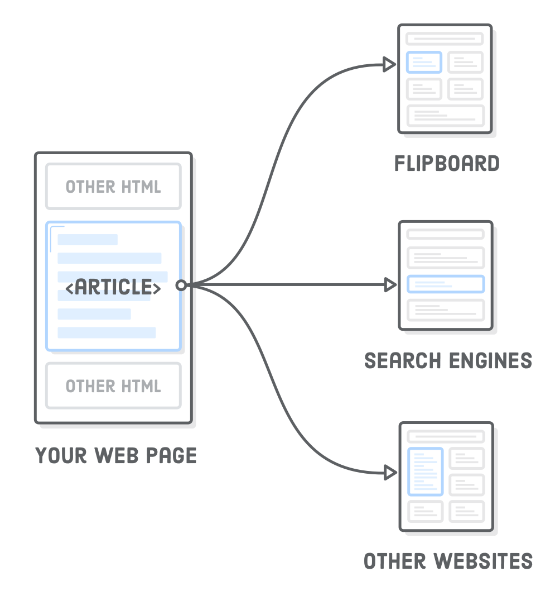
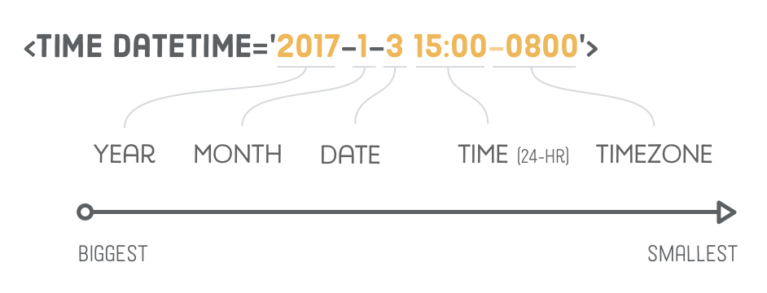

# HTML5 Semantic


## `<article>`

The `article` element represents independent, self-contained content in a web page.
It should ONLY wrap content what could be removed from your page and distributed in a completely different context.




Examples include: a forum post, a magazine or newspaper article, or a blog entry.

The `<article>`’s are essentially mini web pages in your HTML document. They have their own `headers`, `footers`, and document outline that are completely isolated from the rest of your site.

### Using multiple `article` elements

For things like blog posts, newspaper articles, or web pages dedicated to a single topic, there’s often only one `<article>` element on the page. But, it’s perfectly legal to have more than one `<article>` element per page. A good example is a page that displays a bunch of blog posts. Each one of them can be wrapped in a separate set of `<article>` tags:

``` html
<article>
  <h1>First Post</h1>
  <p>Some content</p>
</article>
<article>
  <h1>Second Post</h1>
  <p>Some more content</p>
  <h2>Subsection</h2>
  <p>Some details</p>
</article>
<article>
  <h1>Last Post</h1>
  <p>Final bit of content</p>
</article>
```

This tells anybody looking at our page that there are three distinct articles that can be syndicated. Think of it as a way to merge multiple HTML files into a single document without confusing search engines, browsers, or other machines that are trying to parse our content. If you compare this to a bunch of generic `<div>` elements with arbitrary class names, and you can begin to see how semantic HTML makes the Web a much easier place to navigate.


## `<section>`

The `section` tag defines sections in a document.
According to W3C's HTML5 documentation: _"A section is a thematic grouping of content, typically **with a heading**."_  
This basically means that each `<section>` can have its own set of `<h1>` through `<h6>` headings that are independent of the rest of the page.
However, you shouldn’t use the `section` element to manipulate the document outline in this way because browsers, screen readers, and some **search engines don’t properly interpret the effect of `section`** on the document outline. Instead, always define a page’s outline via heading levels, using `section` only as a replacement for container `div`'s when appropriate.

A home page could normally be split into sections for introduction, content, and contact information.


`REMEMBER:` **This is a semantic tag, not a stylistic one.**

It should not be used to tag a wrapper, a container or any other purely stylistic block.


## `<nav>`

Markups the various navigation sections of your website.  
**The `<nav>` element is a great piece of semantic information for search engines.**  It helps them quickly identify the structure of your entire website, making it easier to discover other pages.

```html
<nav>                                    
  <ul>
    <li><a href='#'>Home</a></li>
    <li><a href='#'>About</a></li>
    <li><a href='#'>Blog</a></li>
    <li><a href='#'>Sign Up</a></li>
  </ul>
</nav>                                  
```
It’s possible to include multiple `<nav>` elements on a single page if you have different sets of related links.

## `<header>`
It denotes introductory content for a section, article, or entire web page. “Introductory content” can be anything from your company’s logo to navigational aids or author information.

A `<header>` element typically contains:

- one or more heading elements (h1 - h6)
- logo or icon
- authorship information

Headers are only associated with the nearest sectioning element—typically a `<body>`, `<section>`, or `<article>` element.

**`Note:`** A header tag cannot be placed within a `<footer>`, `<address>` or another `<header>` element.

## `<footer>`

Conceptually, footers are basically the same as headers, except they generally come at end of an article/website opposed to the beginning. 

Common use cases include things like copyright notices, footer navigation, and author bios at the end of blog posts.


## `<aside>`

**Inside an `article`:**

Headers and footers are ways to add extra information to an article, but sometimes we want to remove information from an article. For example, a sponsored blog post might contain an advertisement about the sponsoring company; however, we probably don’t want to make it part of the article text. This is what the `<aside>` element is for.

 In addition to advertisements, `<aside>` is also appropriate for highlighting definitions, stats, or quotations. If it looks different than the rest of the article, chances are it’s an aside.

**Outside an `article`:**

When used outside an `<article>`, `aside` is associated with the page as a whole (much like `header` and `footer`). This makes it a good choice for marking up a site-wide **sidebar**.

```html
<aside class="sidebar">
  <h2>Sidebar</h2>
  <p>Some sidebar content</p>
  <nav>
    <h3>HTML &amp; CSS Tutorial</h3>
    <ul>
      <li><a href='#'>Introduction</a></li>
      <li><a href='#'>Basic Web Pages</a></li>
      <li><a href='#'>etc...</a></li>
    </ul>
  </nav>
  <nav>
    <h3>JavaScript Tutorial</h3>
    <ul>
      <li><a href='#'>Introduction</a></li>
      <li><a href='#'>Hello, JavaScript</a></li>
      <li><a href='#'>etc...</a></li>
    </ul>
  </nav>
</aside>
```


## When is `<div>` appropiate ?

Always use the semantic HTML tags whenever you can:

- Helps machines infer the structure of your content
- Gives you a standardized vocabulary to organize your web pages.

However, sometimes you need a container element when none of the semantic HTML elements we just covered would make sense. In this cases you can use `<div>`, but purely for layout purposes.

The point is, don’t use semantic elements just for the sake of using them. Implementing them incorrectly is worse than not using them at all, so if you’re ever in doubt, use a <div> instead.


## Dates and Times

The `<time>` tag defines a human-readable date/time.

This element can also be used to encode dates and times in a machine-readable way so that user agents can offer to add birthday reminders or scheduled events to the user's calendar, and search engines can produce smarter search results.

For humans, dates and times come in many forms. You can refer to January 3rd, 2017 as “1/3/2017”, “Jan 3rd”, or even “yesterday” depending on the current date. Parsing this kind of ambiguous natural language is difficult and error-prone for machines, which is where `<time>` comes in.

The machine-readable date is defined in the datetime attribute. An easy way to remember the date format is that it goes from largest time period to smallest: year, month, then date: 




## `<address>`

The `<address>` tag defines the contact information for the author/owner of a document or an article.

If the `<address>` element is inside the `<body>` element, it represents contact information for the document.

If the `<address>` element is inside an `<article>` element, it represents contact information for that article.

The text in the `<address>` element usually renders in italic. Most browsers will add a line break before and after the address element.


## `<figure>` and `<figcaption>`

It's mostly used with pictures but also works for illustrations, tables or diagrams (like in a book).

An interesting characteristic of `<figure>` is that it does not contribute to the document’s outline.
So it can be used to group elements with a common theme, such as a number of images with one common `<figcaption>`, or even a block of code.

A common use case for both of these is to add visible descriptions to the `` elements in an article, like so:

``` html
<figure>
    , <section>, and <nav> elements"/>

    <figcaption>New HTML5 semantic elements</figcaption>
</figure>
```

The `alt` attribute is closely related to the `<figcaption>` element. `alt` should serve as a text replacement for the image, while `<figcaption>` is a supporting description displayed with either the image or its text-based equivalent.

When using `<figcaption>` in the above manner, you can safely omit an image’s `alt` attribute **without hurting your SEO**. Depending on what kind of images you’re working with, it may be more convenient (and less redundant) to have visible `<figcaption>`’s that describe them opposed to invisible `alt` attributes.


## Summary

Defining graphical styles with CSS is how we convey the structure of a web page to humans. By marking it up with `<header>`, `<article>`, `<figure>`, and other HTML sectioning elements, we’re able to represent those visual styles to machines, as well.


