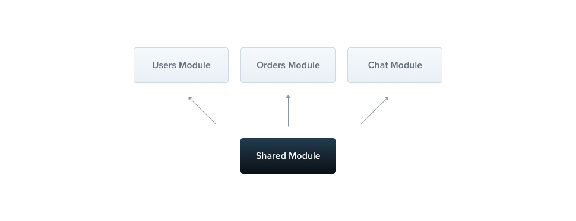

# Modules

Los módulos son las clases con el decorator `@Module()`, la metadata de este decorator es usada por `Nest` para organizar la estructura de la aplicación.


Cada aplicación Nest tiene al menos UN módulo (el `root module` o módulo principal). El `root module` es el lugar donde Nest empieza a organizar el árbol de la aplicación. De hecho, el `root module` podría ser el único módulo de tu aplicación, especialmente cuando tu app es pequeña.  
En la práctica, vas a tener muchos módulos con un conjunto de capacidades fuertemente relacionadas.

El objeto definido dentro del decorator `@Module()` son las propiedades que definen al módulo:

|||
|:-----------:|:--------------------------------------------------------------------------------------------------------------:|
|  components | Los componentes que serán inicializados por el inyector de Nest y que serán compartidos a lo largo del módulo. |
| controllers | El conjunto de controladores que debe ser creado.                                                              |
| modules     | El listado de módulos importados que exportan componentes necesarios para este módulo.                         |
| exports     | El subconjunto de `componentes` que deben de estar disponibles para otros módulos.                               |

El módulo encapsula componentes por defecto. Esto significa que no es posible inyectar componentes que no sean directamente parte del módulo en cuestión, o que no hayan sido exportados por aquellos  que están siendo importados en `modules`.

## CatsModule

El `CatsController` y el `CatsService` están dentro del mismo dominio de la aplicación. Deberían de ser movidos a un módulo específico, el `CatsModule`.

```js
import { Module } from '@nestjs/common';
import { CatsController } from './cats.controller';
import { CatsService } from './cats.service';

@Module({
    controllers: [CatsController],
    components: [CatsService],
})
export class CatsModule {}
```

Acabo de crear el archivo `cats.module.ts` y de mover todo lo relacionado a este módulo a un directorio `cats`. El último paso es importar este módulo al `root module`, que se llama `ApplicationModule`.


```ts
// app.module.ts

import { Module } from '@nestjs/common';
import { CatsModule } from './cats/cats.module';

@Module({
    modules: [CatsModule],
})
export class ApplicationModule {}
```

Eso es todo. Ahora Nest conoce que además de `ApplicationModule`, es crucial registrar `CatsModule` también.


## Shared Module

En Nest, los módulos son `singleton` por defecto, así que puede compartir la misma instancia de tu componente entre 2 o más módulos sin ningún esfuerzo.

**IMPORTANTE:**
En la versiones previas de Nest (< 4), los módulos no eran singletons, había que usar el decorator `@Shared()` el cual dejó de ser soportado.



Todos los módulos son `Shared Modules` de hecho. Una vez creado un módulo,  este es usado en cada módulo. Imaginemos que vamos a compartir la instancia de `CatsService` entre algunos módulos.

```ts
import { Module } from '@nestjs/common';
import { CatsController } from './cats.controller';
import { CatsService } from './cats.service';

@Module({
    controllers: [CatsController],
    components: [CatsService],
    exports: [CatsService]
})
export class CatsModule {}
```

Ahora todo módulos que importen `CatsModule` tendrán acceso a la misma instancia  de `CatsService`.

**IMPORTANTE:** Nunca exportar los `controllers`!

## Modules re-exporting

Los módulos pueden exportar sus componentes. Aún más, incluso pueden re-exportar módulos importados por ellos.

```ts
@Module({
  modules: [CommonModule],
  exports: [CommonModule],
})
export class CoreModule {}
```

## Single Scope

Hay módulos que no deberían ser compartidos en absoluto. Para prevenir que los módulos se conviertan en `singleton`, puedes usar el decorator `@SingleScope()`, el cual hace que Nest siempre cree una nueva instancia del módulo.

```ts
import { Module, SingleScope } from '@nestjs/common';
import { CatsController } from './cats.controller';
import { CatsService } from './cats.service';

@SingleScope()
@Module({
    controllers: [CatsController],
    components: [CatsService],
    exports: [CatsService]
})
export class CatsModule {}
```

## Dependency Injection

Es natural que un módulo pueda `inyectar` componentes que pertenecen a ellos (ej: por motivos de configuración):

```ts
import { Module } from '@nestjs/common';
import { CatsController } from './cats.controller';
import { CatsService } from './cats.service';

@Module({
    controllers: [CatsController],
    components: [CatsService],
})
export class CatsModule {
  constructor(private readonly catsService: CatsService) {}
}
```

Sin embargo, los módulos no pueden ser inyectados por componentes porque se generan [dependencias circulares](https://docs.nestjs.com/advanced/circular-dependency)


