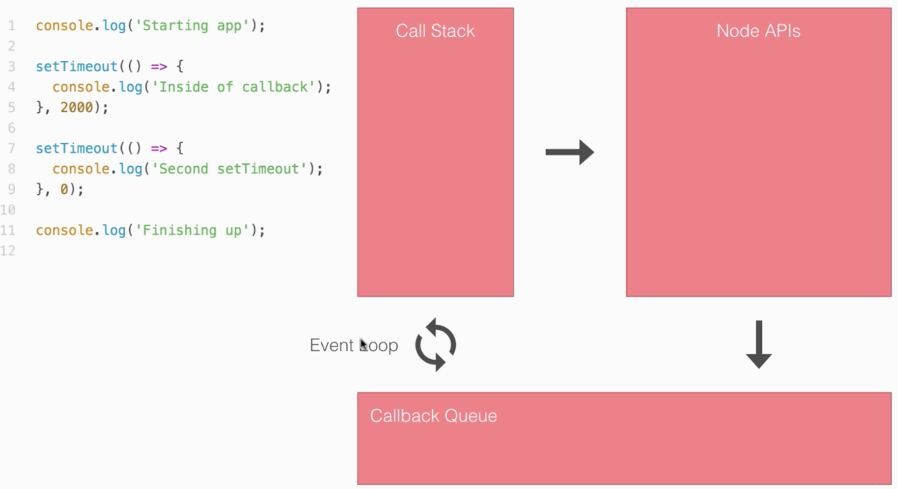

# Asynchronous Node.js
Código asíncrono es aquel que no se bloquea ante una instrucción mientras ejecuta otras

Ejemplo
```js
  console.log('Start app');

  setTimeout(() => {
    console.log('primer setTimeout');
  }, 2000);

  setTimeout(() => {
    console.log('segundo setTimeout');
  }, 0);

  console.log('finish app');
```
```sh
  # Se ejecutará en el siguiente orden

  Start app
  finish app
  segundo setTimeout
  primer setTimeout
```



Node ejecuta toda instrucción mediante el __Call stack__

Cuando hay una instrucción asíncrona (por ejemplo los setTimeout), los almacena en ```Node API```, y derivan en ```Callback Queue``` (cuando corresponde) para ejecutarlo en el orden debido.

El ```event Loop``` controla qué ejecutar en la siguiente instrucción, si el ```call stack``` está vacío ejecuta las instrucciones de ```Callback Queue```

##Callbacks
Callbacks son funciones que se ejecutan dentro de otras, luego de cumplir ciertas condiciones

Ejemplo
```js

  var getUser = (id, callback) => {
    var user = {
      id: id,
      name: 'John'
    };

    setTimeout(() => {
      callback(user);
    }, 3000);
  };

  getUser(31, (userObject) => {
    console.log(userObject);
  });

  // retorna { id: 31, name: 'John'} 3 segundos después

```

Ejemplo de aplicación que dada una dirección muestra la temperatura en la zona, consumiendo datos de la API de Google Maps y la API de Forecast, usando callbacks

Ejemplo de entrada
```sh
  $ node app-callback.js --address 'sinergia cowork'
```

Salida
```sh
  Av. Gonzalo Ramírez 1676, 11200 Montevideo, Uruguay
  Hay 20.8 grados, sensacion termica: 20.8 grados
```

[Código fuente](https://github.com/BuiltByBROS/docs/tree/master/node/playground/weather_api)


## Promises
Promises son funciones asíncronas que ante una petición devuelven dos posibles valores, ```resolve``` que maneja el resultado y ```reject``` para manejar errores.

Ejemplo de uso
```js
  let asyncAdd = (a, b) => {
    return new Promise((resolve, reject) => {
      setTimeout(() => {
        if (typeof a === 'number' && typeof b === 'number') {
          resolve(a + b);
        } else {
          reject('Argumentos deben ser números');
        }
      }, 2000);
    });
  };

  // caso 1
  asyncAdd(5, 7).then((res) => {
    console.log('Resultado: ', res);
  }, (errorMessage) => {
    console.log(errorMessage);
  });

  // salida: Resutado: 12


  // caso 2, error
  asyncAdd(5, '7').then((res) => {
    console.log('Resultado: ', res);
  }, (errorMessage) => {
    console.log(errorMessage);
  });

  // salida: Argumentos deben ser números


  // caso 3 promesas encadenadas
  asyncAdd(5, 7).then((res) => {
    console.log('Resultado: ', res);
    return asyncAdd(res, 33);
  }, (errorMessage) => {
    console.log(errorMessage);
  }).then((res) => {
    console.log('Deberia ser 45', res);
  }, (errorMessage) => {
    console.log(errorMessage);
  });
  // salida: Resutado: 45

  // caso 4 error en promesa
  asyncAdd(5, '7').then((res) => {
    console.log('Resultado: ', res);
    return asyncAdd(res, 33);
  }, (errorMessage) => {
    console.log(errorMessage);
  }).then((res) => {
    console.log('Deberia ser 45', res);
  }, (errorMessage) => {
    console.log(errorMessage);
  });
  // salida: Argumentos deben ser números
  // salida: Resutado: undefined

  // el problema es que se sigue ejecutando la cadena de promesas.
  // para esto está la cláusula catch
  asyncAdd(5, '7').then((res) => {
    console.log('Resultado: ', res);
    return asyncAdd(res, 33);
  }).then((res) => {
    console.log('Deberia ser 45', res);
  }).catch((errorMessage) => {
    console.log(errorMessage);
  });

```

## Axios, librería para hacer requests asíncronas

Ejemplo de aplicación que dada una dirección muestra la temperatura en la zona, consumiendo datos de la API de Google Maps y la API de Forecast, usando callbacks

Ejemplo de entrada
```sh
  $ node app-promises.js --address 'sinergia cowork'
```

Salida
```sh
  Av. Gonzalo Ramírez 1676, 11200 Montevideo, Uruguay
  Hay 20.8 grados, sensacion termica: 20.8 grados
```

[Código fuente](https://github.com/BuiltByBROS/docs/tree/master/node/playground/weather_api)


## Async/Await

Ejemplo de la misma aplicación usando cláusulas async/await

``` NOTA: Es válido a partir de node versión 8 ```

```js

let encodeAddress = encodeURIComponent(argv.address);
let geoCodeUrl = `http://maps.googleapis.com/maps/api/geocode/json?address=${encodeAddress}`;

async function getTemperature(geoUrl) {
  const geo = await axios.get(geoUrl);
  let lat = geo.data.results[0].geometry.location.lat;
  let lng = geo.data.results[0].geometry.location.lng;

  console.log(geo.data.results[0].formatted_address);

  let weatherUrl = `https://api.forecast.io/forecast/7ae78936ade432ee61aa7e170afbc9ca/${lat},${lng}`;
  const weather = await axios.get(weatherUrl);

  let temperature = weather.data.currently.temperature;
  let apparentTemperature = weather.data.currently.apparentTemperature;
  console.log(`Hay ${temperature} grados, sensacion termica: ${apparentTemperature} grados`);
};

getTemperature(geoCodeUrl);

```

Un buen ejemplo explicando los tres métodos, callbacks, promises y async/await [link](https://kamilmysliwiec.com/typescript-2-1-introduction-async-await)
