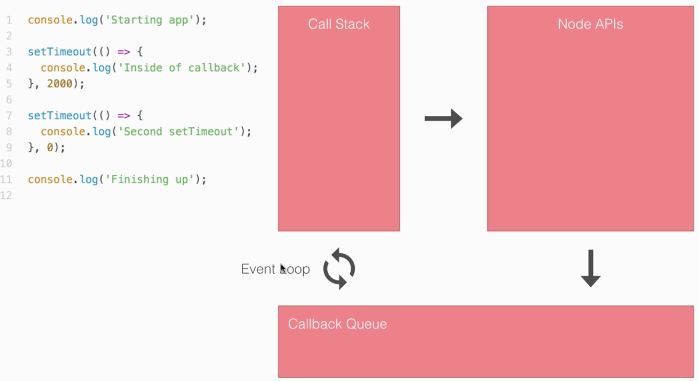

# Apuntes basados del curso The Complete Node.js Developer Course (2nd Edition)
[The Complete Node.js Developer Course (2nd Edition)](https://www.udemy.com/the-complete-nodejs-developer-course-2/learn/v4/overview)

__Node es un engine basado en javascript el cual da la posibilidad de extender el uso por fuera del navegador__

De esta manera se permite manipular archivos, consultar bases de datos, etc.

## Sección 1: Welcome
## Sección 2: Instalación de Node js

Se asumen las dos primeras secciones, ver [doc de Node](https://nodejs.org/es/)

## Sección 3: Fundamentos de Node.js

### Uso de require

  - Sirve para invocar librerías nativas de node
  - librerías de terceros
  - archivos/librerías externos propios

  ```js
      // Ejemplo de uso de librerías de sistema (os)
      const os = require('os');
      let user = os.userInfo();
      console.log(`Hola ${user.username}`);
      // > Hola braulio
  ```

  ```js
      // Ejemplo de uso de archivos externos propios

      // external.js
      console.log('external.js content');

      // app.js
      console.log('app.js content');
      const external = require('./external.js');

      // Ejemplo de salida en consola
      // > app.js content
      // > external.js content

  ```

#### Uso de exports
Sirve para exportar propiedades dentro de un modulo, para ser consumidas por otro.

```js
  // external.js
  module.exports.age = 20;

  // app.js
  const external = require('./external.js');

  console.log(`Tu edad es ${external.age}`);
  // Tu edad es 20

```

También puede aplicar a funciones

```js
  // external.js
  module.exports.addExternal = () => {
    return 'soy external.js';
  };

  // app.js
  const external = require('./external.js');

  console.log(`respuesta: ${external.addExternal()}`);
  // respuesta: soy external.js

```

---
Mini desafio:

Escribir una funcion en external.js que reciba 2 enteros y devuelva el producto entre ellos (asumimos que no hay que controlar tipos de entradas)

Solución

```js
  // external.js
  module.exports.product = (a, b) => {
    return a * b;
  };

  // app.js
  const external = require('./external.js');

  console.log(`respuesta: ${external.product(2, 3)}`);
  // respuesta: 6

```

---

#### Instalación de paquetes de terceros

```sh
  # Se crea el archivo package.json
  $ npm init

  # Se siguen los pasos para generar el package.json

  # Para instalar paquetes de terceros:
  $ npm install <pkgName> --save

  # Ejemplo lodash
  $ npm install lodash --save

```

Ejemplo de uso

```js
  // require de librerias del core
  const fs = require('fs');
  // require de 3rd party
  const _ = require('lodash');
  // require de librerias del core
  const external = require('./external');

  // ejemplo usando lodash
  console.log(_.isString('Juan'));
  // true
  console.log(_.uniq([3, 1, 2, 3, 5, 4, 5]))
  // [3, 1, 2, 5, 4]

```
Mas info en la página de [lodash](https://lodash.com/docs)

### Instalación de nodemon
Nodemon es un watcher que reinicia la aplicación node cuando un archivo es guardado

```sh
  # Es necesario instalar nodemon global
  $ npm install nodemon -g

  # Las aplicaciones se ejecutaran de la siguiente manera:
  $ nodemon app.js
```

### Argumentos a traves de la consola

Los procesa via ```process.argv```

Ejemplo:
```sh
  $ node app.js

  # en app.js
  console.log(process.argv);

  # [ '/Users/brauliodeleon/.nvm/versions/node/v6.9.0/bin/node',
  #   '/Users/brauliodeleon/repos/node-course/app.js' ]

  # Si paso argumentos:
  $ node app.js hola

  # [ '/Users/brauliodeleon/.nvm/versions/node/v6.9.0/bin/node',
  #   '/Users/brauliodeleon/repos/node-course/app.js',
  #   'hola' ]

  # La forma de trabajo será la siguiente:

  $ node app.js comando
```
```js
  // app.js
  var command = process.argv[2]
  if (command === 'comando') {
    console.log('El argumento es comando');
  } else {
    console.log('argumento no reconocido');
  }


```
El recibir argumentos por línea de comandos puede escalar fácilmente
por ejemplo:
```sh
  $ node app.js ingresarObjeto --name="titulo" --body="contenido"
```
Para esto hay una librería que resuelve esta funcionalidad [Yargs](https://github.com/yargs/yargs)


### Debugging
Se puede debuggear vía inspector o con chrome dev tools

##### Usando Inspector. (node v8+) vía command line.

```sh
  $ node inspector app.js
  # comienza en la línea 1 si no hay breakpoints

  $ n # next line
  $ c # continua hasta el próximo breakpoint

```

- Agregando la sentencia ```debugger``` en el código, se agrega un _breakpoint_.

- Usando la cláusula ```repl``` para el debugger y se puede inspeccionar elementos
Ejemplo

```js
  // En app.js
  var person = {
    name: 'Andrew'
  };

  person.age = 25;

  debugger; // Agrega un breakpoint

  person.name = 'Mike';
```
```sh
  # en la consola
  $ node inspect app.js # va hacia la linea donde está debugger
  debug> repl
  debug> person # { name: 'Andrew', age: 25 }
```

#####

Usando Chrome Dev Tools

```sh
  $ node --inspector-brk app.js
```

En Chrome tipeamos chrome://inspector y accedemos al link con la aplicación corriendo.

Usando ```nodemon``` se puede correr una nueva instancia de debugging cada vez que se guarda un archivo

```sh
  $ nodemon --inspect-brk app.js
```

### Arrow functions
Es una nueva funcionalidad de ES6 que busca mejorar la legibilidad del código

Ejemplo básico
```js
  // ES5
  function cuadrado(x) {
    return x * x;
  }
  console.log(cuadrado(9)); // 81


  // ES6: Arrow Functions
  var cuadrado = x => x * x;
  console.log(cuadrado(9)); // 81
```

Arrow functions no tienen el concepto de ```this```. Acá va un ejemplo

```js
  var user = {
    name: 'John',
    sayHi: () => {
      console.log(`Hi, I'm ${this.name}`);
    },
    sayHiAlt() {
      console.log(`Hi, I'm ${this.name}`);
    }
  }

  user.sayHi(); // Hi, I'm undefined
  user.sayHiAlt(); // Hi, I'm John

```

## Sección 4: Asynchronous Node.js
Código asíncrono es aquel que no se bloquea ante una instrucción mientras ejecuta otras

Ejemplo
```js
  console.log('Start app');

  setTimeout(() => {
    console.log('primer setTimeout');
  }, 2000);

  setTimeout(() => {
    console.log('segundo setTimeout');
  }, 0);

  console.log('finish app');
```
```sh
  # Se ejecutará en el siguiente orden

  Start app
  finish app
  segundo setTimeout
  primer setTimeout
```



Node ejecuta toda instrucción mediante el __Call stack__

Cuando hay una instrucción asíncrona (por ejemplo los setTimeout), los almacena en ```Node API```, y derivan en ```Callback Queue``` (cuando corresponde) para ejecutarlo en el orden debido.

El ```event Loop``` controla qué ejecutar en la siguiente instrucción, si el ```call stack``` está vacío ejecuta las instrucciones de ```Callback Queue```

### Callbacks
Callbacks son funciones que se ejecutan dentro de otras, luego de cumplir ciertas condiciones

Ejemplo
```js

  var getUser = (id, callback) => {
    var user = {
      id: id,
      name: 'John'
    };

    setTimeout(() => {
      callback(user);
    }, 3000);
  };

  getUser(31, (userObject) => {
    console.log(userObject);
  });

  // retorna { id: 31, name: 'John'} 3 segundos después

```

Ejemplo de aplicación que dada una dirección muestra la temperatura en la zona, consumiendo datos de la API de Google Maps y la API de Forecast, usando callbacks

Ejemplo de entrada
```sh
  $ node app-callback.js --address 'sinergia cowork'
```

Salida
```sh
  Av. Gonzalo Ramírez 1676, 11200 Montevideo, Uruguay
  Hay 20.8 grados, sensacion termica: 20.8 grados
```

[Código fuente](https://github.com/BuiltByBROS/docs/tree/master/node/playground/weather_api)


### Promises
Promises son funciones asíncronas que ante una petición devuelven dos posibles valores, ```resolve``` que maneja el resultado y ```reject``` para manejar errores.

Ejemplo de uso
```js
  let asyncAdd = (a, b) => {
    return new Promise((resolve, reject) => {
      setTimeout(() => {
        if (typeof a === 'number' && typeof b === 'number') {
          resolve(a + b);
        } else {
          reject('Argumentos deben ser números');
        }
      }, 2000);
    });
  };

  // caso 1
  asyncAdd(5, 7).then((res) => {
    console.log('Resultado: ', res);
  }, (errorMessage) => {
    console.log(errorMessage);
  });

  // salida: Resutado: 12


  // caso 2, error
  asyncAdd(5, '7').then((res) => {
    console.log('Resultado: ', res);
  }, (errorMessage) => {
    console.log(errorMessage);
  });

  // salida: Argumentos deben ser números


  // caso 3 promesas encadenadas
  asyncAdd(5, 7).then((res) => {
    console.log('Resultado: ', res);
    return asyncAdd(res, 33);
  }, (errorMessage) => {
    console.log(errorMessage);
  }).then((res) => {
    console.log('Deberia ser 45', res);
  }, (errorMessage) => {
    console.log(errorMessage);
  });
  // salida: Resutado: 45

  // caso 4 error en promesa
  asyncAdd(5, '7').then((res) => {
    console.log('Resultado: ', res);
    return asyncAdd(res, 33);
  }, (errorMessage) => {
    console.log(errorMessage);
  }).then((res) => {
    console.log('Deberia ser 45', res);
  }, (errorMessage) => {
    console.log(errorMessage);
  });
  // salida: Argumentos deben ser números
  // salida: Resutado: undefined

  // el problema es que se sigue ejecutando la cadena de promesas.
  // para esto está la cláusula catch
  asyncAdd(5, '7').then((res) => {
    console.log('Resultado: ', res);
    return asyncAdd(res, 33);
  }).then((res) => {
    console.log('Deberia ser 45', res);
  }).catch((errorMessage) => {
    console.log(errorMessage);
  });

```

### Axios, librería para hacer requests asíncronas

Ejemplo de aplicación que dada una dirección muestra la temperatura en la zona, consumiendo datos de la API de Google Maps y la API de Forecast, usando callbacks

Ejemplo de entrada
```sh
  $ node app-promises.js --address 'sinergia cowork'
```

Salida
```sh
  Av. Gonzalo Ramírez 1676, 11200 Montevideo, Uruguay
  Hay 20.8 grados, sensacion termica: 20.8 grados
```

[Código fuente](https://github.com/BuiltByBROS/docs/tree/master/node/playground/weather_api)


### Async/Await

Ejemplo de la misma aplicación usando cláusulas async/await

``` NOTA: Es válido a partir de node versión 8 ```

```js

let encodeAddress = encodeURIComponent(argv.address);
let geoCodeUrl = `http://maps.googleapis.com/maps/api/geocode/json?address=${encodeAddress}`;

async function getTemperature(geoUrl) {
  const geo = await axios.get(geoUrl);
  let lat = geo.data.results[0].geometry.location.lat;
  let lng = geo.data.results[0].geometry.location.lng;

  console.log(geo.data.results[0].formatted_address);

  let weatherUrl = `https://api.forecast.io/forecast/7ae78936ade432ee61aa7e170afbc9ca/${lat},${lng}`;
  const weather = await axios.get(weatherUrl);

  let temperature = weather.data.currently.temperature;
  let apparentTemperature = weather.data.currently.apparentTemperature;
  console.log(`Hay ${temperature} grados, sensacion termica: ${apparentTemperature} grados`);
};

getTemperature(geoCodeUrl);

```

Un buen ejemplo explicando los tres métodos, callbacks, promises y async/await [link](https://kamilmysliwiec.com/typescript-2-1-introduction-async-await)

## Seccion 5: Express Framework

Es una librería para crear webapps, maneja el modelo MVC sobre node.
Maneja routing, middlewares, authentication, etc.

Ejemplo mínimo una aplicación express.

```js

  const express = require('express');
  var app = express();

  app.get('/', (req, res) => {
    res.send('Hello world');
    // la respuesta será del tipo 'text/html'
  });

  app.get('/json-way', (req, res) => {
    res.send({
      nombre: 'Juan',
      edad: 23
    });
    // la respuesta será del tipo 'application/json'
  });

  app.listen(3000);

```

Ejemplo manejando vistas con handlebars
```sh
  $ npm install hbs --save
```
Las vistas en express se manejan por default en una carpeta views
```js
  const express = require('express');
  const hbs = require('hbs');

  var app = express();

  app.set('view engine', 'hbs');
  app.use(express.static(__dirname + '/public'));

  app.get('/', (req, res) => {
    res.render('main.hbs', {
      title: 'Home Page',
      h1: 'Home',
      paragraph: 'Bienvenido a la web'
    });
  });

  app.listen(3000);

```
```html
<!-- main.hbs -->
<!DOCTYPE html>
<html>
  <head>
    <meta charset="utf-8">
    <title>{{ title }}</title>
  <head>
  <body>
    <h1>{{ h1 }}</h1>
    <p>{{ paragraph }}</p>
  </body>
</html>
```

### Middlewares
Son funciones que ante una request (que coincide con la ruta solicitada) se ejecutan previamente.
Por ejemplo: en un sitio hay una ```request``` para acceder al perfil de un usuario, express debería verificar si la request tiene los permisos necesarios para mostrar esa información.
Esa función de middleware, chequea si se cumplen las condiciones, y si se cumple, se invoca la función para mostrar los datos del perfil

```js
  const express = require('express');
  const hbs = require('hbs');
  const fs = require('fs');

  var app = express();

  app.set('view engine', 'hbs');
  app.use(express.static(__dirname + '/public'));

  // uso de middlewares
  app.use((req, res, next) => {
    // este caso es trivial, al llamar a next() se invoca la siguiente funcion
    next();
  });

  // ejemplo para loggear requests
  app.use((req, res, next) => {
    var now = new Date().toString();
    var log = `${now} ${req.method} ${req.url}`;
    fs.appendFile('server.log', log + '\n');
    next();
  });

  app.get('/', (req, res) => {
    res.render('main.hbs', {
      title: 'Home Page',
      h1: 'Home',
      paragraph: 'Bienvenido a la web'
    });
  });

  app.listen(3000);

```

## Sección 6: Testing

### Testing usando Mocha

Ejemplo:
```js
// utils.js
module.exports.add = (a, b) => a + b;
```

```js
// utils.test.js
const utils = require('./utils');
it('deberia sumar 2 numeros', () => {
  var res = utils.add(33, 11);
  if (res !== 44) {
    throw new Error(`Expected 44 pero el resultado fue ${res}`);
  }
});


```
```sh
  ✓ deberia sumar 2 numeros

  1 passing (6ms)

```

Una forma para correr un watcher para tests

```sh
  $ nodemon --exec 'npm test'
```

Generalizando, en el package.json:

```json

  "scripts": {
    "test": "mocha **/*.test.js",
    "test-watcher": "nodemon --exec 'npm test'"
  },

```

### Usando jest

```sh
  $ npm i jest --save
```

```json
  "scripts": {
    "test": "jest",
    "test-watcher": "nodemon --exec 'npm test'"
  },
```

```js
  const utils = require('./utils');


  describe('tests', () => {
    test('test 1', () => {
      var res = utils.add(3, 9);
      expect(res).toBe(12);
    });

    test('test 2', () => {
      var res = utils.add(3, 4);
      expect(res).toBeLessThan(13);
    });

    test('test 3', () => {
      var obj = {
        value1: 3,
        value2: 5
      };
      expect(obj.value1).toBe(3);
    });
  });
```
### Test en funciones asíncronas.

De forma muy similar a como se testea código sincrónico, en este caso pasamos una función de callback que indica a mocha que se esta ejecutando una función asincrónica y que debe esperar a que esta termine para verificar los resultados.

```js
  it('should async add two numbers', (done) => {
    utils.addAsync(4, 3, (sum) => {
      expect(sum).toBe(7).toBeA('number');
      done();
    })
  })
```

### Test de aplicaciones express.

Para comenzar creamos una simple aplicación express:

```js
  const express = require('express');

  var app = express();

  app.get('/', (req, res)  => {
    res.send('Hello world!');
  });

  app.listen(3000);
```

 Para facilitar el proceso de testear estas aplicaciones instalamos la siguiente librería:

 ```sh
    npm i supertest --save-dev
 ```

desarrollada por los creadores de express.

Escribimos el test de la siguiente forma:

```js
  const request = require('supertest');
  const app = require('./server').app;

  it('should return hello world response', (done) => {
    request(app)
      .get('/')
      .expect(200)
      .expect('Hello world!')
      .end(done);
  })
```

### Spies

Las Spies son útiles para testear la invocación a funciones dentro de otras, sin realmente hacerlo. Para esto definimos una spy que reemplaza la función cuya invocación queremos probar por otra función con fines únicamente de prueba.

En el siguiente código creamos una spy, la invocamos y utilizando expect verificamos que haya sido incovada.

```js
const expect = require('expect');

describe('App', () => {

  it('Should call the spy correctly', () => {
    const spy = expect.createSpy();
    spy();
    expect(spy).toHaveBeenCalled();
  })

})
```

También podemos llamar a la spy con parámetros y verificar que haya sido invocada con estos. Simplemente intercambiando estas líneas:

```js
spy('Schubert', 24);
expect(spy).toHaveBeenCalledWith('Schubert', 24);
```

Asumiendo que tenemos el siguiente código:

```js
const db = require('./db');

module.exports.handleSingUp = (email, password) => {
  // Check if the email already exists
  db.saveUser({ email, password });
  // Send a welcome email
}
```
Sobre el cual queremos probar que cada vez que handleSingUp es invocada, se invoca también db.saveUser con los párametros correctos. Lo primero que debemos hacer es reemplazar la función db.saveUser por una spy. Para esto utilizamos un módulo de npm llamado "rewire".

```sh
  $ npm i rewire@2.5.2 --save-dev
```

Rewire requiere utilizarse como si fuese "require", de esta forma importamos el módulo que queremos modificar.

```js
  const app = rewire('./app')
```
Lo que hace rewire en esta línea es un "require" del módulo app y a la vez agrega dos métodos útiles para reemplazar propiedades.

```js
  app.__set__
  app.__get__
```
De esta forma usando el primero de los metodos reemplazamos la función, incovamos a quien la contiene y verificamos que haya ocurrido utilizando expect.

```js
const expect = require('expect');
const rewire = require('rewire');

const app = rewire('./app');

describe('App', () => {

  // We create the spy that wraps up the function that we want to replace 'saveUser'
  var db = {
    saveUser: expect.createSpy()
  }

  // We replace the function on our module using rewire methods
  app.__set__('db', db);

  it('should call the spy correctly', () => {
    const spy = expect.createSpy();
    spy('Schubert', 24);
    expect(spy).toHaveBeenCalledWith('Schubert', 24);
  })

  it('should call saveUser with user object', () => {
    const email = 'schubert@bros.me';
    const password = 'password';

    app.handleSignUp(email, password);
    expect(db.saveUser).toHaveBeenCalledWith();
  })

})
```
